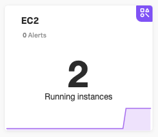

# Lab: Webserver Troubleshooting 

A powerful aspect of Splunk Infrastructure Monitoring is having a comprehensive view of your full-stack environment. In this lab, you will use navigators to drill into the problems with your Apache Web Server using relevant metrics and logs in real-time.


## Lab Environment

- Two EC2 instances with Apache web server and PHP installed. 

  

- Splunk Open Telemetry Collector deployed on both instances.

  	

- Additional `stress` utility installed on the first instance ([i-0fdc11a37b00a57de](https://eu-west-2.console.aws.amazon.com/ec2/home?region=eu-west-2#InstanceDetails:instanceId=i-0fdc11a37b00a57de)) to intentionally stress the CPU and increase its usage to around 90%. 
  
  
  
## Lab Instructions

  1. Log in to the Splunk Observability Cloud:
     ``` 
     Username: tomek@novvicki.pl
     Password: syzqyb-najtis-sihFo8
     ```
  
     
  
  2. Select **Infrastructure** from the left-hand menu.

     

  3. Make sure you can see two instances under the **Amazon Web Services** category. You should see the following navigator.
     
  
     
  
  4. Drill down on the navigator by clicking on it.
     

  5. You should see two EC2 instances.
  
     
  
  6. Now, let's put some stress on the CPU. Use the `curl` command in the terminal or your browser to request: http://ec2-13-40-65-48.eu-west-2.compute.amazonaws.com/stress1.php
  
     ```sh
     curl http://ec2-13-40-65-48.eu-west-2.compute.amazonaws.com/stress1.php
     ```
  
     
  
  7. This will stress the CPU for about 60 seconds. You should see the following result:
  
     ```sh
     $curl http://ec2-13-40-65-48.eu-west-2.compute.amazonaws.com/stress1.php
     Stress test completed:
     stress: info: [165552] dispatching hogs: 4 cpu, 0 io, 0 vm, 0 hdd
     stress: info: [165552] successful run completed in 60s
     ```
     
  
     
  8. In the Splunk Observability Cloud, click on the `i-0fdc11a37b00a57de_eu-west-2_772081369355` instance. You should see an increase in the CPU utilization.
  
     
  
  9. Now, let's put some stress on the CPU for a longer period of time. Use the `curl` command in the terminal or your browser to request: http://ec2-13-40-65-48.eu-west-2.compute.amazonaws.com/stress10.php
  
     ```sh
     curl http://ec2-13-40-65-48.eu-west-2.compute.amazonaws.com/stress10.php
     ```
  
     
  
     > [!NOTE]
     >
     > This time, the HTTP response will be "504 Gateway Timeout." This is because the command takes longer to execute. Don't worry about that.

  

  10. Use the breadcrumbs navigation to get back to the EC2 view.

  

  11. In the top-right corner, switch from Table view to Heat Map view.
  
  12. In this view, instances are represented by squares. 
  
      
  
  13. Give it a few minutes until enough instance data is gathered. One instance should light up red soon. In Heat Map view, when you hover over a square in a navigator, you can see the information about the instance represented by the square.
  
      
  
  14. Drill down into the instance with higher CPU utilization. 
  
  15. Click on the **Show Processes** link and identify which processes are consuming overage of resources.   
  
      
  
  16. You should be able to identify `stress` commands triggered by the apache user.
  
      
  
      > [!NOTE]
      >
      > If you look closer, you will see the `splunk-otel-collector` process running. This is us. Keeping our finger on the pulse of your infrastructure.
  
      
  
  17. Congrats! You have just identified the process using the overage of your instance resource. 

  

## Summary

In this lab, we have explored the capabilities of Splunk Infrastructure Monitoring to gain a comprehensive view of a full-stack environment. Specifically, we:

1. Investigated Apache Web Server Issues:
   - Used Splunk Infrastructure Navigators to drill down and identify problems with the Apache Web Server.
   - Accessed and interpreted relevant metrics and logs in real-time to diagnose issues.
2. Monitored in Real-Time:
   - Utilized real-time data to monitor the performance and health of the Apache Web Server through Splunk Infrastructure Navigators.
   - Quickly pinpointed and addressed any problems that arose.

By completing this lab, we gained a deeper understanding of leveraging Splunk Infrastructure Monitoring and Navigators to effectively maintain and troubleshoot the web server environment.