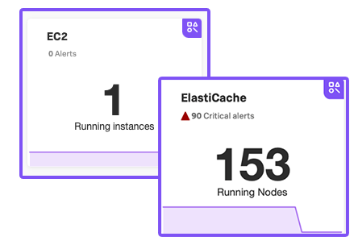
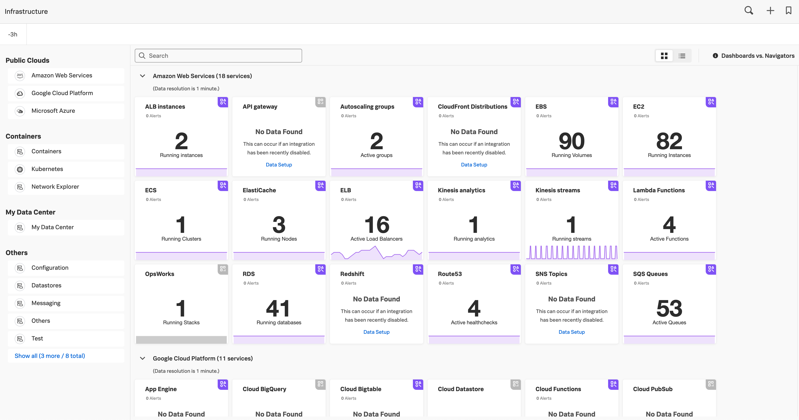
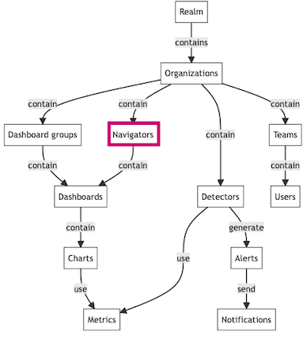

## Splunk Infrastructure Monitoring
### Navigators
In this section, you will learn how to orient and explore different layers of your tech stacks using **navigators** in Splunk Infrastructure Monitoring.

Tomasz Nowicki

---

### What Is Navigator?

A navigator is a collection of **resources** that lets you monitor metrics across various instances of integration and detect outliers among the instances of that integration.

**Resources** include but are not limited to:

- Dashboards
- Related alerts and detectors
- Service dependencies
!Note:
Navigator is a collection of resources that lets you monitor metrics and logs across various instances of your services and detect outliers in the instance population based on key performance indicators. Resources in a navigator include but are not limited to, a full list of entities, dashboards, related alerts and detectors, and service dependencies.

--

### All Navigators View

!Note:
To see all navigators, select Infrastructure from the Splunk Observability Cloud home page.
On the Infrastructure Monitoring landing page, each card represents a navigator, corresponding to the services you monitor in Splunk Observability Cloud. A navigator card shows a count of instances in the population and highlights critical alerts linked to that population.

---

### Navigators In The Hierarchy

Navigators act as a bridge between high-level organizational views and detailed metric data, enabling users to efficiently manage and monitor their infrastructure.

!Note:
Navigators are integral to the overall structure of Splunk Infrastructure Monitoring. They act as a bridge between high-level organizational views and detailed metric data, enabling users to efficiently manage and monitor their infrastructure. Their placement within the hierarchy highlights their importance in providing contextual and actionable insights across different layers of the infrastructure.

---

## Instance Monitoring Options
In most navigators, you have two options to monitor your instances: 
- Table view
  - Default view for a navigator. Instances are sorted in descending order based on the relative value of the metric you select from the Color by drop-down menu.
- Heat map view
  - Each square has a color representing the relative value of the metric you select from the Color by drop-down menu.

!Note:
Table view
This is the default view for a navigator. Instances are sorted in descending order based on the relative value of the metric you select from the Color by drop-down menu. You can reverse the sorting order or select different sorting criteria by clicking available column headers.
You can’t add or remove columns from the table view. 
Heat map view: Each square has a color representing the relative value of the metric you select from the Color by drop-down menu.

The colors range from low values (lighter colors) to high values (darker colors).
You can’t change the default colors for each Color‑by option.
The navigator automatically sets the value range for each color.

---

## Drill-Down Capabilities

You can drill down from a high-level view into specific components to investigate issues in detail. 

For instance, starting from a high-level overview of the entire infrastructure, drill down into a particular host and further into a specific application running on that host.

---

## Demo
### Navigators

---

## Discussion
How to use Splunk Infrastructure Monitoring in order to solve problems?
!Note:
Webserver monitoring, Application monitoring, Database monitoring.

---

## Lab 1
### Webserver Troubleshooting

--

## Lab Overview
A powerful aspect of Splunk Infrastructure Monitoring is having a comprehensive view of your full stack environment. In this lab you will drill in to see problems with your Apache Web Server using relevant metrics and logs in real time.

Lab link: https://app.eu0.signalfx.com

Lab username: lab_User2024

Lab password: jBvyWbPlUs
