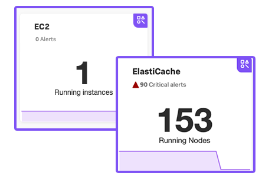

### What is a navigator?
A **navigator** is a collection of resources that lets you monitor metrics across various instances of integration and detect outliers among the instances of that integration.

Resources include but are not limited to:

- Dashboards
- Related alerts and detectors
- Service dependencies
!Note:
*Navigator is a collection of resources that lets you monitor metrics and logs across various instances of your services and detect outliers in the instance population based on key performance indicators. Resources in a navigator include but are not limited to, a full list of entities, dashboards, related alerts and detectors, and service dependencies.*