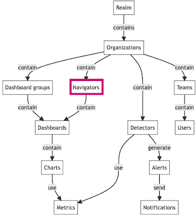

### Navigators in the hierarchy

Navigators act as a bridge between high-level organizational views and detailed metric data, enabling users to manage and monitor their infrastructure efficiently.

!Note:
*Navigators are integral to the overall structure of Splunk Infrastructure Monitoring. They act as a bridge between high-level organizational views and detailed metric data, enabling users to manage and monitor their infrastructure efficiently. Their placement within the hierarchy highlights their importance in providing contextual and actionable insights across different layers of the infrastructure.*

--

### Dashboards vs. Navigators

!Note:
*A question that naturally arises is: What is the diffrence between a dashboard and a navigator. A dashboard is a set of charts that allow you to gain actionable insight into your system. Use dashboards to visualize and organize your data. A navigator is a set of screens that allow you to orient and explore your tech stack. To monitor instances you should use navigators.*